# 🏋️‍♀️ GYM Management System

A responsive web-based system to manage gym operations digitally — replacing manual receipts and updates with real-time billing, notifications, and member management using Firebase.

---

## 🧰 Tech Stack

- **Frontend**: HTML, CSS, JavaScript
- **Backend**: Firebase (Authentication, Firestore Database)
- **Animations**: AOS (Animate On Scroll), CSS keyframes
- **Hosting**: Firebase Hosting / GitHub Pages

---

## 👥 Login Credentials (for demo)

| Role  | Email                | Password   |
|-------|----------------------|------------|
| Admin | test@example.com     | 123456     |
| Member| member1@example.com  | member1    |
| User  | user1@example.com    | user123    |

---

## 🔐 Firebase Firestore Collections Used

- `assignedPackages`
- `bills`
- `members`
- `notifications`
- `users`

---

## 🧩 Modules & Features

### 👨‍💼 Admin
- Login authentication
- Add, update, and delete member records
- Assign fee packages
- Generate bills for members
- Send notifications to members:
  - Working/non-working days
  - Holiday announcements
  - Upcoming membership expirations
- Export monthly reports (**PDF and CSV** options)
- Manage supplement store (add/edit items)
- Assign 4 diet plans: **Weight Loss, Shredding, Maintenance, Bulk**

### 🧍 Member
- Login with email/password
- View **bill receipts**
- View **notifications**
- ❌ No access to diet plans

### 👤 User
- Login to access general gym details
- View **basic gym member details**
- Use **search and filters** for easy access

---

## 🔄 Workflow

1. **Login** using appropriate role credentials
2. Admin manages backend: adds members, assigns packages, generates bills
3. Members access their bills and alerts
4. Users can search and view basic member info
5. All updates sync live with Firebase backend

---

## 🧪 Test Cases

| Feature              | Input                     | Expected Output                              |
|----------------------|---------------------------|----------------------------------------------|
| Login (Admin)        | test@example.com / 123456 | Redirect to admin dashboard                  |
| Add Member           | Form values               | Member added to `members` collection         |
| Generate Bill        | Amount + Member           | Stored in `bills`, receipt shown to member   |
| Assign Package       | Plan + Member             | Saved in `assignedPackages`                  |
| Export Report        | PDF/CSV button click      | Downloads billing data                       |
| Send Notification    | Holiday text              | Member views under notifications             |
| Receipt View (Member)| Member clicks bill card   | Opens bill receipt                           |
| Search Members (User)| Filter: Plans             | Shows matching entries in real-time          |

---

## 🎨 UI Highlights

- **AOS Library** used for homepage animations
- **CSS Keyframe animations** across other pages
- **Search & filter functionality** available in admin/user dashboards
- Clean and mobile-responsive layout
- Modular structure for scalability

---

## 📁 Folder Structure
gym-management-system/
├── HTML/
│ ├── loginpage.html
│ ├── admin.html
│ └── ...
├── CSS/
│ ├── loginpage.css
│ ├── admin.css
│ └── ...
├── JS/
│ ├── loginpage.js
│ ├── admin.js
│ ├── auth.js
│ └── firebase-config.js
│ └─ ...
├── screenshots/
│ ├── login.png
│ ├── admin-dashboard.png
│ └── ...
├── README.md

---

## 📸 Screenshots

### 🔐 Home Page  
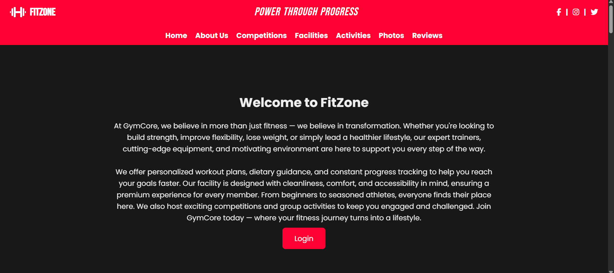

### 🔐 Login Page  
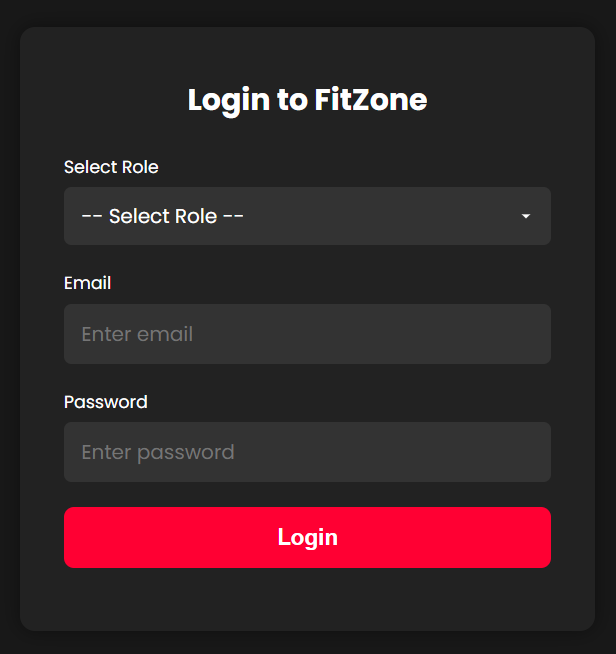

### 🧑‍💼 Admin Dashboard  
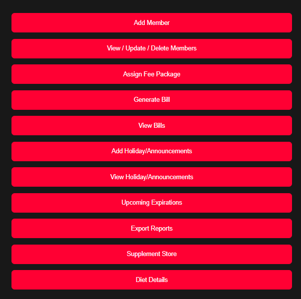

### 🧑‍💼 Add Member
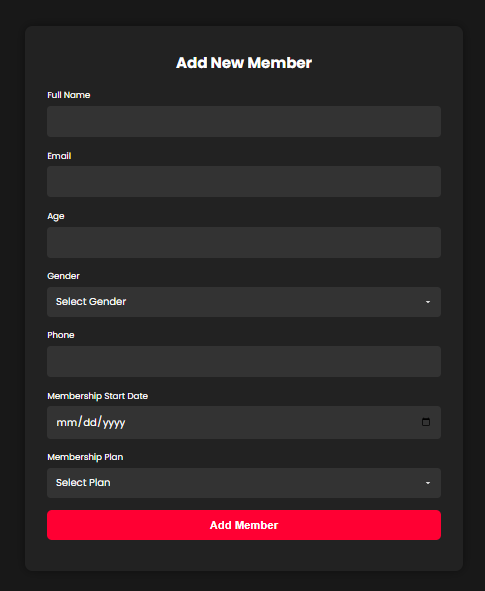

### 🔐 Update Members 
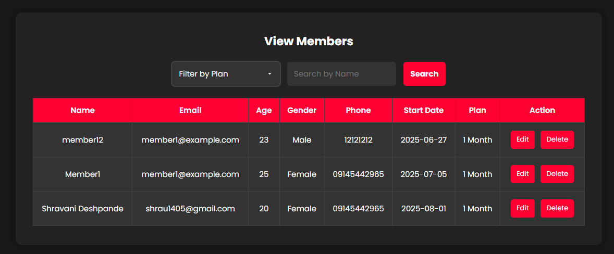

### 🔐 Generate Bill
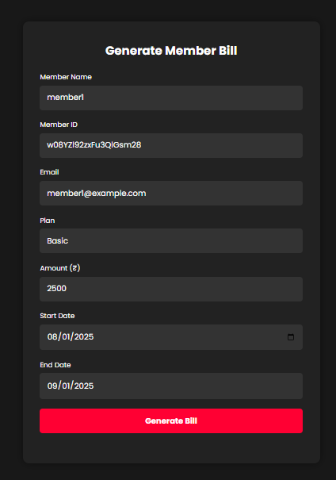

### 🔐 Holiday/Announcements  
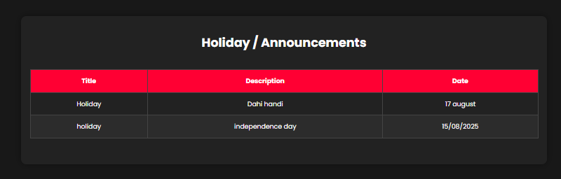

### 🔐 Export Reports
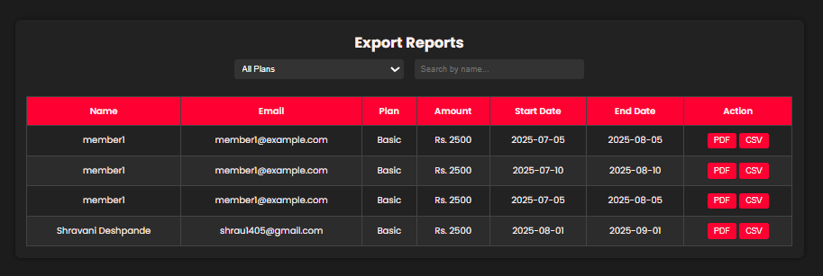

### 🔐 Upcoming Expirations
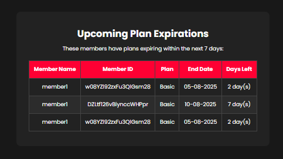

### 🔐 Supplement  
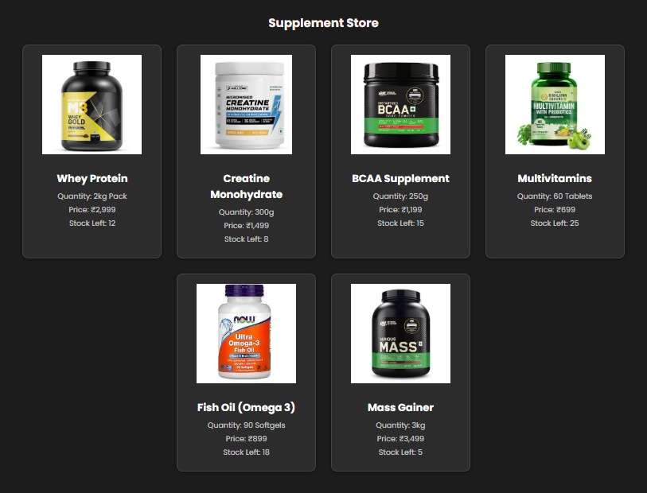

### 🧾 Diet 
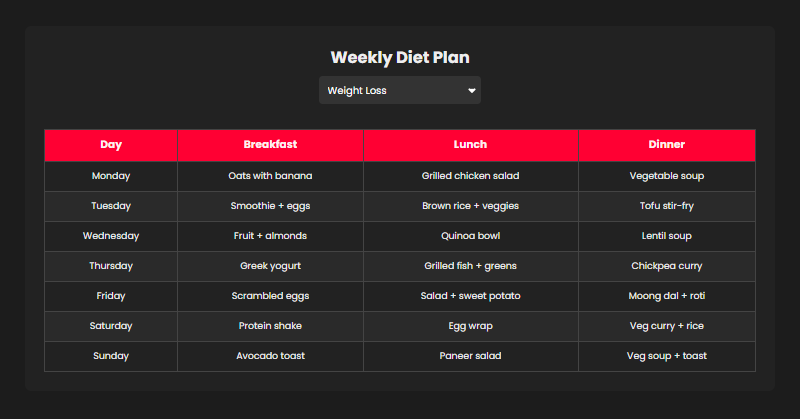

### 🔐 Member Dashbaord  
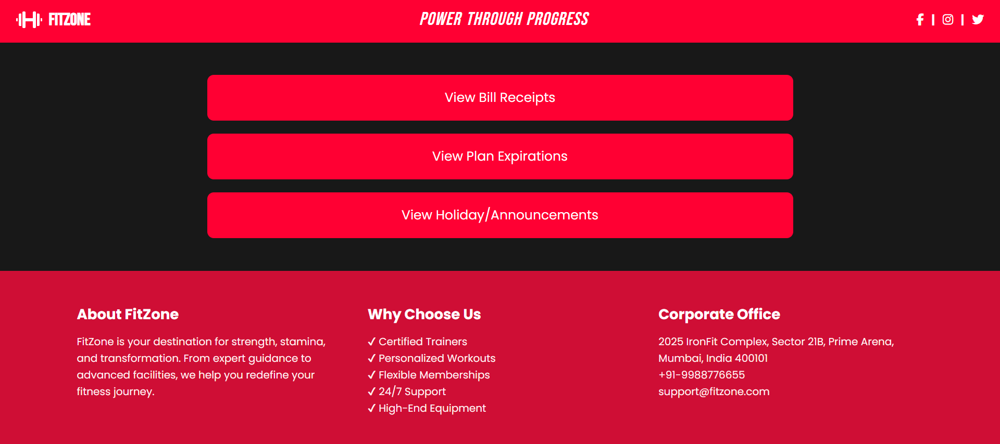

### 🔐 User Dashbaord  
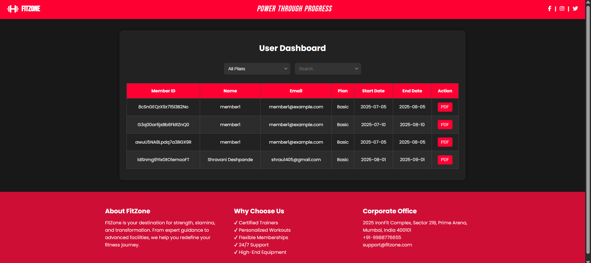

### 🔐 Firebase(Firestore)
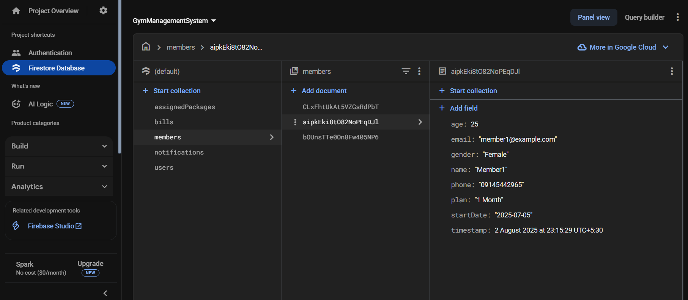

